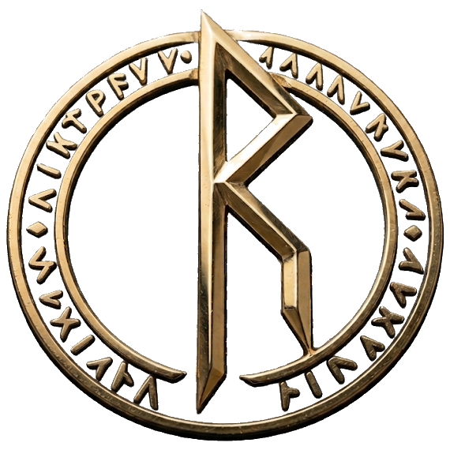
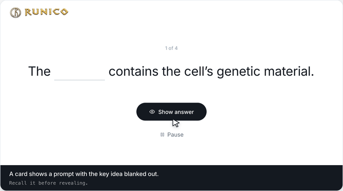
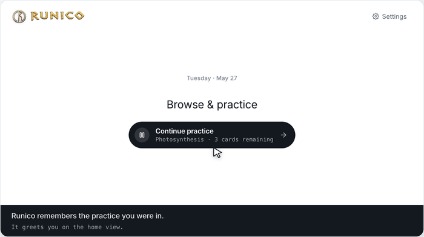
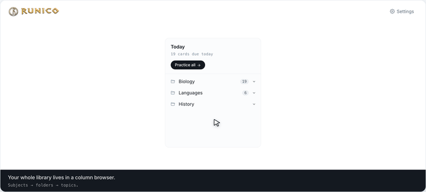
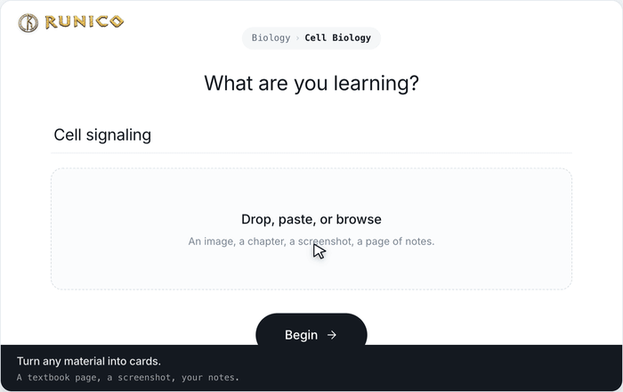
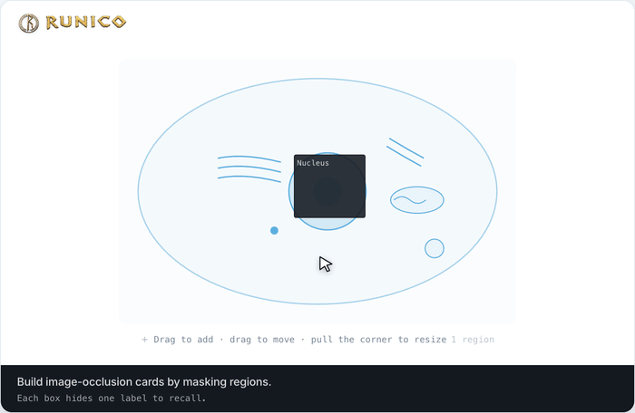
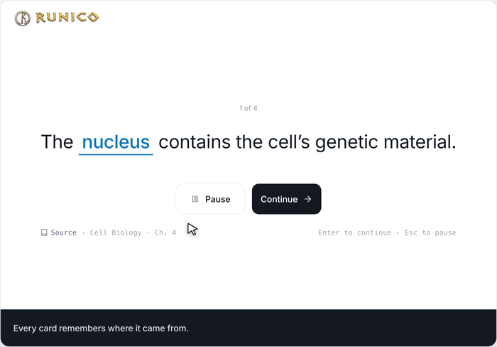

### Magical runes for your learning

Runico turns anything you're learning into flashcards and helps you practice them —
recall the answer, reveal it, then Continue or Pause, with no grading scales to fuss over.

### ▶ [Launch the live prototype](https://nordic-ocean.github.io/runico/app/)

Runs entirely in your browser · mock data persists in your session

---

## A quick tour of Runico

Seven short, looping demos — one per feature. Everything plays automatically.
Each section links to a full step-by-step walkthrough.

### 1 · Study a card

> Recall the answer, reveal it, then Continue or Pause — no grading scales to fuss over.

**[Full walkthrough →](tutorial/01-study-a-card.md)**

### 2 · Pick up where you left off

> The home view remembers your last session and shows how many cards remain.

**[Full walkthrough →](tutorial/02-pick-up-where-you-left-off.md)**

### 3 · Browse & practice

> Navigate subjects, folders, and topics in a column browser, then practice any topic.

**[Full walkthrough →](tutorial/03-browse-and-practice.md)**

### 4 · Add cards from anything

> Drop in material, let Runico draft cards, then keep the ones worth studying.

**[Full walkthrough →](tutorial/04-add-cards-from-anything.md)**

### 5 · Mask an image

> Draw, drag, and resize boxes over a figure to build image-occlusion cards.

**[Full walkthrough →](tutorial/05-mask-an-image.md)**

### 6 · See the source

> Open the original material as a book page, with the studied term highlighted in context.

**[Full walkthrough →](tutorial/06-see-the-source.md)**

### 7 · Make it yours

> Choose a canvas theme and the language for your cards and interface.

**[Full walkthrough →](tutorial/07-make-it-yours.md)**

---

## Try the prototype

A fully interactive, mock-data build of the app — browse the library, study cards
(including image-occlusion), generate and review AI draft cards, rename/add/delete
cards and folders, and switch themes and language. **Everything you change is saved to
your browser's session storage**, so it survives reloads within the tab and resets when
you close it.

**▶ [Open the live prototype](https://nordic-ocean.github.io/runico/app/)**

Prefer to run it locally? See [`app/`](app/) — `python3 -m http.server --directory app`, then open the printed URL.

## At a glance

- **Study without grading scales.** Reveal the answer, then choose **Continue** or **Pause** — that's it.
- **Always resumable.** Runico remembers the exact card you stopped on.
- **A library you can navigate.** Subjects → folders → topics, in a column browser.
- **Cards from any material.** Drop in a page, screenshot, or notes and Runico drafts cards for you to review.
- **Image-occlusion cards.** Mask regions of a figure to study diagrams and labels.
- **Source in context.** Every card links back to the original material, shown like a book page.
- **Make it yours.** Light / Warm / Dark canvas themes and per-language cards and interface.

## The full tutorial

Every feature has its own page with a step-by-step walkthrough in
**[`tutorial/`](tutorial/)** — start at the [tour index](tutorial/README.md).

---

Runico · feature tour

