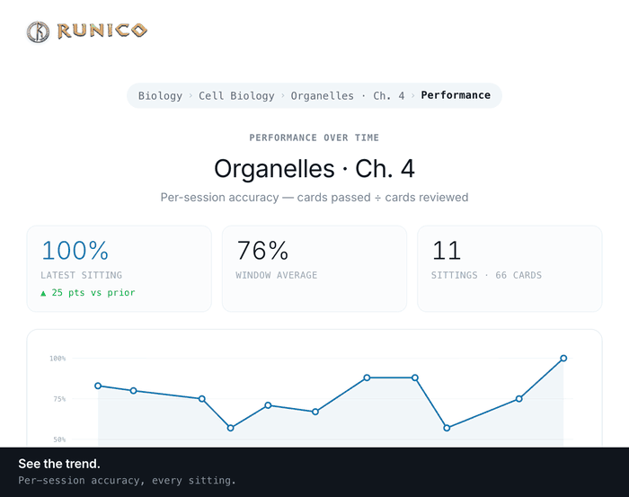

[← Back to the tour](README.md)

# 4 · Track your progress

> See whether a topic is trending up — per-session accuracy over time, with a drill-down to any single card.

  
   Looping demo · plays automatically

Every session quietly records how you did, and Track your progress turns that into a
picture: a line of **per-session accuracy** — the cards you got right ÷ the cards you
reviewed, each sitting — so you can see whether a topic is actually improving. It's
reporting only: looking never changes what's due or how cards are scheduled.

## Walkthrough

1. **Open a topic's progress.** Tap _View progress_ on a topic — in the browser or on its **Open cards** screen.
2. **See the trend.** Per-session accuracy, plotted across the last 30 days.
3. **Read the numbers.** Your latest sitting, the window average, and how many sittings.
4. **Page back through time.** Step through earlier or later 30-day spans.
5. **Drill into one card.** Pick a card to see each sitting as a pass or a miss.
6. **Back to the deck.** Return to the whole-topic trend anytime.

## What you see

- There are two ways in: a **View progress** button on a topic's action card, and the same
  on its **Open cards** screen — where the **accuracy-trend** banner doubles as a
  _View full performance →_ link.
- The headline is **per-session accuracy** — cards passed ÷ cards reviewed, the raw pass
  rate for each sitting. No scores, no jargon, no modelled "retention."
- The chart runs time along the bottom and accuracy **0–100%** up the side, with a soft
  area fill and a tooltip on every point (e.g. _17/20 passed · May 12_). A span with no
  sittings shows a quiet empty state.
- A stats row reads out your **latest sitting** (with a ▲ / ▼ change vs. the one before),
  the **window average**, and the **sittings** count (_· N cards_).
- The window rolls **30 days** at a time — it opens on the last 30 days, and
  **Earlier / Later 30 days** page through your whole history, with the visible date range
  labelled beneath the chart.
- Below the chart, every card is listed with a mini sparkline and its window pass-rate;
  pick one and the chart switches to that card's **pass (green) / miss (red)** per sitting.
  **Deck overview** returns you to the topic trend.
- It's **reporting only** — checking your progress never affects grading or what comes up next.

---

[← Browse & practice](03-browse-and-practice.md)  ·  [↑ Tour index](README.md)  ·  Next: [Add cards from anything →](05-add-cards-from-anything.md)

