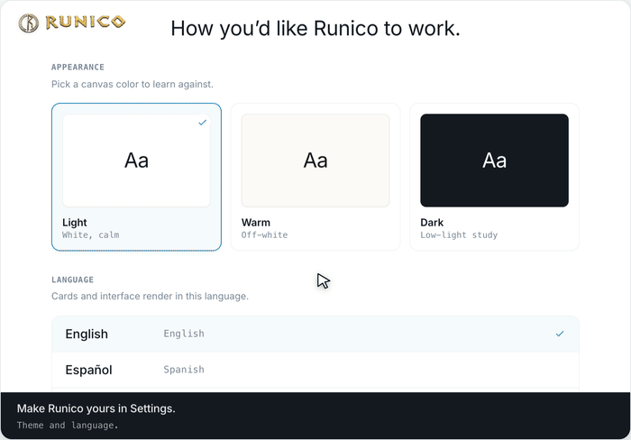

[← Back to the tour](README.md)

# 8 · Make it yours

> Choose a canvas theme and the language for your cards and interface.

  
   Looping demo · plays automatically

Make Runico yours in **Settings** — pick a canvas color to learn against, and the
language your cards and interface render in.

## Walkthrough

1. **Make Runico yours in Settings.** Theme and language.
2. **Switch the canvas to Warm…**
3. **…or Dark for low-light study.**
4. **Pick the language for cards and the interface.**

## What you see

**Appearance** — _pick a canvas color to learn against:_

| Theme | Canvas | Note |
|-------|--------|------|
| Light | White (`#FFFFFF`) | White, calm |
| Warm | Off-white (`#FBFAF7`) | Off-white |
| Dark | Near-black (`#141920`) | Low-light study |

**Language** — _cards and interface render in this language:_

- English
- Spanish (_Español_)
- Mandarin Chinese (_中文_)

---

[← See the source](07-see-the-source.md)  ·  [↑ Tour index](README.md)

That's the tour. ✨

